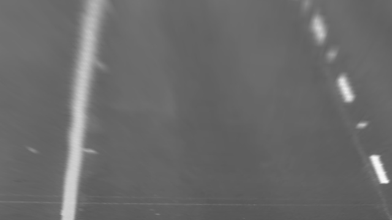
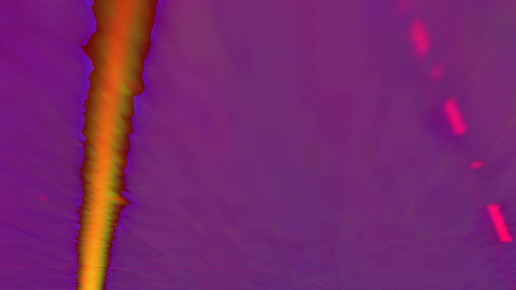
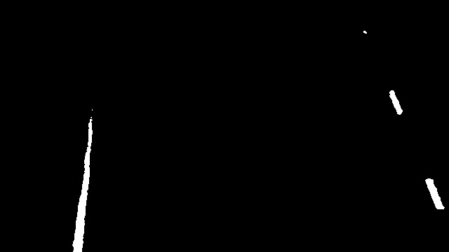

# Lane-Line Detector
Project is still WIP and README will be updated continiously, some information is outdated and some is missing.

## Project Description
A lane-line detector is essential for self-driving cars and serves as an excellent way to learn and showcase computer vision techniques. In this project, I explore different methods to detect lane lines. The techniques implemented include:

### Detection Methods
2 different detection methods was investigated. Both will be explained in some detail below
1. **CannyHoughDetector**  
    

2. **SlidingWindowDetector**  
    - Applies thresholding and performs a perspective transform on the region-of-interest (ROI).  
    - Uses a sliding window to detect lane lines. Points on the lines are then used to fit a polynomial describing the lane-line, allowing detection of curves.  
    - Lane lines are detected in the transformed space and later mapped back to pixel space, where they are displayed on the original image.

## Step 1: **Selecting Region of Interest (ROI)**

First, the **Region of Interest (ROI)** is selected by the user through **4 mouse clicks** on the image. The user picks the corners of the region they want to transform. You can visualize the points by referring to the image, where the **red dots** represent the selected ROI.

- **Image:** 

After the user selects the ROI, we perform a **perspective transformation** to isolate the chosen region of interest. This allows further processing to focus on just the ROI.

---

## Step 2: **Perspective Transformation**

Once the ROI is chosen, a **perspective transformation** is applied to the image. This transforms the image so that only the selected ROI remains in focus, and the rest of the image is discarded. 

This ensures that only the relevant area of the image is processed, simplifying the lane detection process.

- **Image:**   
  *(Red dots mark the ROI points)*

---

## Step 3: **Binary Mask Creation**

After the perspective transformation, the next step is to create a **binary mask** of the transformed image. This mask is used to highlight the lane lines. The image goes through the following stages:

1. **Convert to Grayscale:** The image is first converted to grayscale to remove color information, leaving only intensity.
   - **Image:** 

2. **Gaussian Blur:** The grayscale image is blurred using a **Gaussian Blur** to reduce noise.
   - **Image:** 

3. **HSV Conversion:** The image is then converted to the HSV color space, which helps in isolating specific colors more effectively, especially for detecting yellow and white lanes.
   - **Image:** 

4. **White Lane Mask:** A binary mask is created to isolate white lane lines using a thresholding technique.
   - **Image:** 

5. **Yellow Lane Mask:** A separate binary mask is created to isolate yellow lane lines using color filtering in the HSV space.
   - **Image:** 

6. **Combined Mask:** Finally, the white and yellow lane masks are combined to create the final binary mask, which highlights both yellow and white lane lines.
   - **Image:** 

---

## Step 4: **Base Detection Using Histogram**

Once we have the binary mask, the next step is to detect the base positions of the lane lines. This is done using a **histogram** of pixel intensities along the horizontal axis. The histogram represents the distribution of non-zero pixels (lane line pixels) in the lower half of the image.

- **Image:** 

The peaks in the histogram correspond to the **x-values** of the lane line base positions. The left lane base is determined from the left half of the image, and the right lane base is determined from the right half.

---

## Step 5: **Sliding Window Approach**

With the lane line base positions detected, a **sliding window** approach is used to track the lane lines across the entire image. The sliding window method works by searching for lane pixels in several vertical windows across the image, starting from the detected base and moving upward.

- **Image:** 

For each window, the mean **x-position** of the lane pixels is calculated, and the window is adjusted accordingly to search for the next lane points.

---

## Step 6: **Lane Line Fitting**

After detecting the lane points in each window, a polynomial fit is applied to the points to estimate the lane lines more accurately.

---

This step-by-step process ensures that the lane lines are detected accurately, even under challenging conditions such as varying lighting and road markings.
-
## TODO
- [x] Finish basic lane-line detection algorithm
- [x] Create the video and save it instead of showing at run time
- [x] Calculate one line from all hough lines
- [x] Perspective transform and sliding window approach (https://www.youtube.com/watch?v=ApYo6tXcjjQ&t=214s)
- [ ] Test to do thresholding in transformed space (To find longer lane further away)
- [ ] Make predicted line lengths shorter when necessary (curves)
- [ ] Add Car detector
- [ ] Find the drivable field as the area between the lane-lines
- [ ] Find data-set for deep-learning approach
- [ ] Implement deep-learning approach
- [x] Calculate FPS when running algortihm

## Installation
Step-by-step instructions on how to set up the lane-line detector locally:
1. Clone the repository: `git clone git@github.com:SimonJonsson1999/lane-detection.git`
2. Navigate to the project directory: `cd lane-line-detector`
3. Install dependencies: `pip install -r requirements.txt`

## Usage
Details on how to use the lane-line detector effectively:
1. Prepare your input data (images or video files).
2. Run the detection script: `python main.py`

## Results

